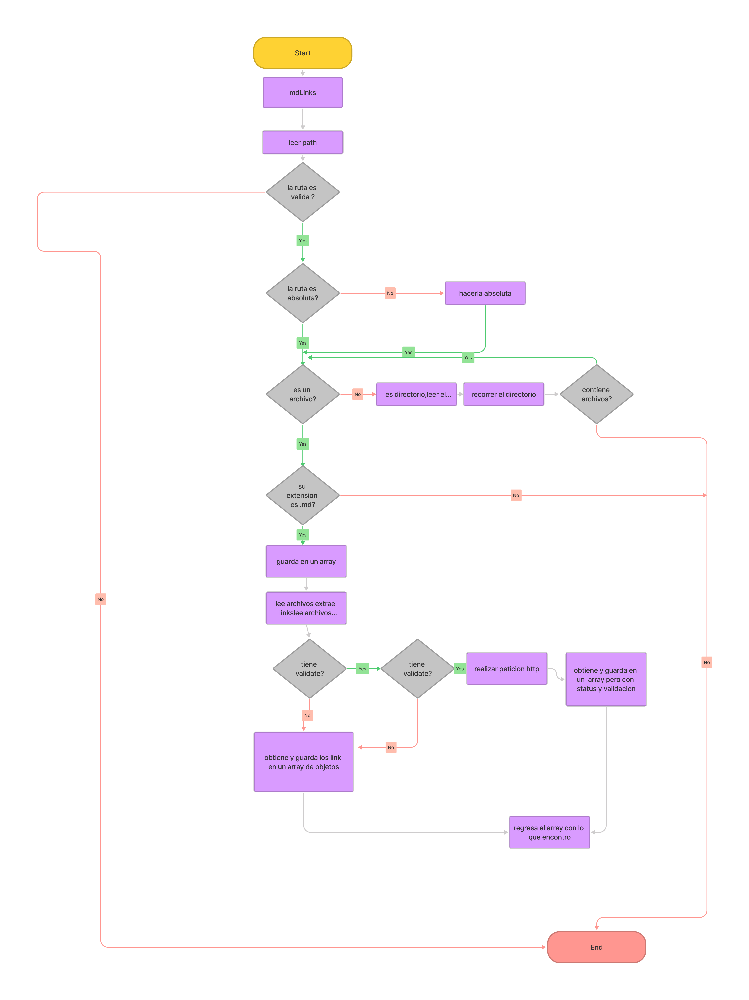

# Markdown Links

## Índice

* [1. MdLinks](#1-MdLinks)
* [2. Instalación ](#2-Instalación)
* [3. Modo de Ejecución](#3-Modo-de-Ejecución)
* [4. Diagrama de Flujo ](#4-Diagrama-de-Flujo )

***

## 1. MdLinks

Md-links es una iniciativa que tiene como objetivo analizar una ruta específica 
en busca de enlaces que se encuentren dentro de archivos mark-down (.md). 
Una vez localizados, se devuelve un objeto que incluye información como el nombre del enlace, 
el enlace mismo y la ubicación en la que fue encontrado. Además de esto, md-links ofrece una función de 
validación que comprueba el estado y el mensaje de los enlaces encontrados. 
En resumen, se trata de una herramienta útil y eficaz para la gestión de enlaces en archivos mark-down.

El análisis de los links consiste en obtener la siguiente información:

href: URL encontrada.
text: Texto que aparecía dentro del link (<a>).
file: Ruta del archivo donde se encontró el link.
status: Código de respuesta HTTP.
ok: Mensaje fail en caso de fallo u ok en caso de éxito.

## 2. Instalación
Instalar la libreria via npm install --global <github-user>/md-links

## 3. Modo de Ejecución
se escribe mareslib +  path 
en caso de necesitar las opciones de --validate  o --stats se agregan despues del path 
--validate
Si pasamos la opción --validate, el módulo debe hacer una petición HTTP para averiguar si el link funciona o no. Si el link resulta en una redirección a una URL que responde ok, entonces consideraremos el link como ok.

Por ejemplo:

$ md-13d99df067c1
./some/example.md http://algo.com/2/3/ ok 200 Link a algo
./some/example.md https://otra-cosa.net/algun-doc.html fail 404 algún doc
./some/example.md http://google.com/ ok 301 Google
Vemos que el output en este caso incluye la palabra ok o fail después de la URL, así como el status de la respuesta recibida a la petición HTTP a dicha URL.

--stats
Si pasamos la opción --stats el output (salida) será un texto con estadísticas básicas sobre los links.

$ md-links ./some/example.md --stats
Total: 3
Unique: 3
También podemos combinar --stats y --validate para obtener estadísticas que necesiten de los resultados de la validación.

$ md-links ./some/example.md --stats --validate
Total: 3
Unique: 3
Broken: 1

## 4. Diagrama de Flujo 

